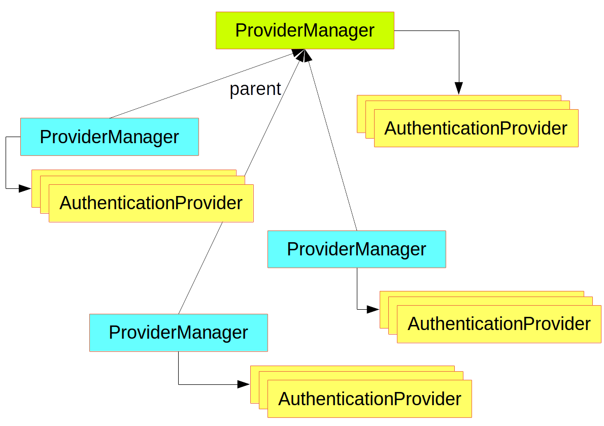
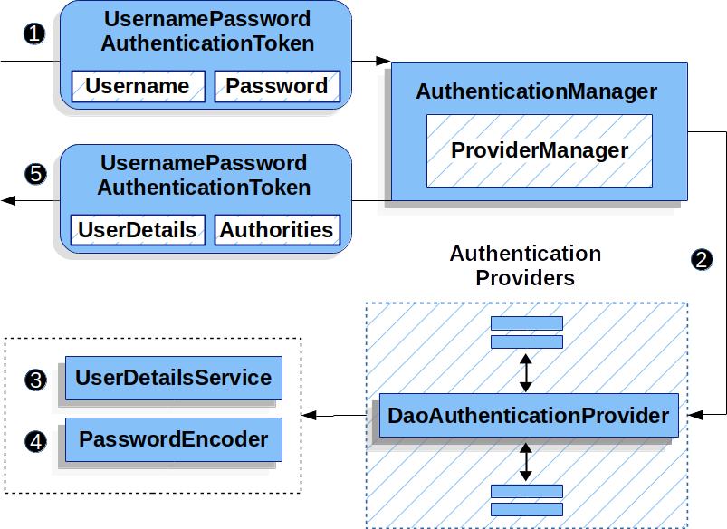

# Spring Security

## Web Security

`Spring Security`在web层是基于servlet容器的`Filter`来实现的。下图展示了一个http请求从client到servlet的处理过程。


- Servlet容器根据请求路径来决定应用哪些Filters及交由哪个Servlet来处理
- 这些Filters形成一个有序的链，某个环节的Filter如果处理了该请求就可以略过后面的

Spring Boot有两种方式可以定义Filter的顺序：

1. 在`@Bean`装饰的Filter类上加`@Order`装饰
2. 在`FilterRegistrationBean`中定义


Spring Security就是其中的一个Filter，类型为`DelegatingFilterProxy`(这个代理对象不需要被`@Bean`装饰)，它包含一个类型为`Filter`的委托，类型为`FilterChainProxy`，是在`ApplicationContext`类中声明的一个`@Bean`，名字为`springSecurityFilterChain`，顺序是`SecurityProperties.DEFAULT_FILTER_ORDER`。

`FilterChainProxy`内部又包含了多个`Filter`，是由这些`Filter`完成验证逻辑的。

如下图:


`FilterChainProxy`中包含多个Filter链(`SecurityFilterChain`)，每个链有各自的匹配规则以及若干个Filter，会根据请求的地址把请求分配给第一个匹配的链来处理当前这个请求。


Spring Boot程序中默认有6个过滤器的链，第一个链过滤静态资源或错误页面，最后一个链过滤默认路径如`/**`，这个链中默认有11个过滤器，处理基本的验证如: authentication, authorization, exception handling, session handling, header writing等等。默认的顺序为`SecurityProperties.BASIC_AUTH_ORDER`，可通过配置`security.basic.enabled=false`开关。

若自定义一个匹配规则需要继承`WebSecurityConfigurerAdapter`，如下:

```java
@Configuration
@Order(SecurityProperties.BASIC_AUTH_ORDER - 10)
public class ApplicationConfigurerAdapter extends WebSecurityConfigurerAdapter {
  @Override
  protected void configure(HttpSecurity http) throws Exception {
    http.antMatcher("/foo/**")
     ...;
  }
}
```

- 可以创建多个`WebSecurityConfigurerAdapter`的实现，用`@Order`定义它们的顺序
- 如果定义了一个`WebSecurityConfigurerAdapter`，会覆盖默认的规则。
- 不同的匹配规则可以有不同的处理行为，例如有的返回401，有的重定向到登录页面

在`WebSecurityConfigurerAdapter`中配置匹配规则的时候注意区分两种匹配，一个是用来决定当前的链来处理哪个请求路径，另外的匹配用来决定是否有相应权限。

```java
@Configuration
@Order(SecurityProperties.BASIC_AUTH_ORDER - 10)
public class ApplicationConfigurerAdapter extends WebSecurityConfigurerAdapter {
  @Override
  protected void configure(HttpSecurity http) throws Exception {
    http.antMatcher("/foo/**")
      .authorizeRequests()
        .antMatchers("/foo/bar").hasRole("BAR")
        .antMatchers("/foo/spam").hasRole("SPAM")
        .anyRequest().isAuthenticated();
  }
}
```

第一个`antMatcher("/foo/**")`说明如果请求路径是`/foo/**`的话，用当前的配置做处理。第二个`antMatchers("/foo/bar").hasRole("BAR")`说明请求`/foo/bar`的时候要求有`BAR`权限。

**Spring Boot Actuator**

如果项目中引用了`Spring Boot Actuator`，它会有一个默认的过滤器，序号为`ManagementServerProperties.BASIC_AUTH_ORDER`，比默认的`SecurityProperties`过滤器小5，所以它会比默认的过滤器先执行。

## Filters


`FilterChain` Usage Example

```java
public void doFilter(ServletRequest request, ServletResponse response, FilterChain chain) {
    // do something before the rest of the application
    chain.doFilter(request, response); // invoke the rest of the application
    // do something after the rest of the application
}
```

### DelegatingFilterProxy


```java
public void doFilter(ServletRequest request, ServletResponse response, FilterChain chain) {
    // Lazily get Filter that was registered as a Spring Bean
    // For the example in DelegatingFilterProxy delegate is an instance of Bean Filter0
    Filter delegate = getFilterBean(someBeanName);
    // delegate work to the Spring Bean
    delegate.doFilter(request, response);
}
```

### FilterChainProxy


### SecurityFilterChain


### Security Filters

Spring Security Filter ordering:

- ChannelProcessingFilter
- ConcurrentSessionFilter
- WebAsyncManagerIntegrationFilter
- SecurityContextPersistenceFilter
- HeaderWriterFilter
- CorsFilter
- CsrfFilter
- LogoutFilter
- OAuth2AuthorizationRequestRedirectFilter
- Saml2WebSsoAuthenticationRequestFilter
- X509AuthenticationFilter
- AbstractPreAuthenticatedProcessingFilter
- CasAuthenticationFilter
- OAuth2LoginAuthenticationFilter
- Saml2WebSsoAuthenticationFilter
- UsernamePasswordAuthenticationFilter
- ConcurrentSessionFilter
- OpenIDAuthenticationFilter
- DefaultLoginPageGeneratingFilter
- DefaultLogoutPageGeneratingFilter
- DigestAuthenticationFilter
- BearerTokenAuthenticationFilter
- BasicAuthenticationFilter
- RequestCacheAwareFilter
- SecurityContextHolderAwareRequestFilter
- JaasApiIntegrationFilter
- RememberMeAuthenticationFilter
- AnonymousAuthenticationFilter
- OAuth2AuthorizationCodeGrantFilter
- SessionManagementFilter
- ExceptionTranslationFilter
- FilterSecurityInterceptor
- SwitchUserFilter

### ExceptionTranslationFilter

`ExceptionTranslationFilter`会将`AccessDeniedException`和`AuthenticationException`异常转换为HTTP responses


1. `ExceptionTranslationFilter`首先调用`FilterChain.doFilter(request, response)`执行后面的Filter
2. 如果有`AuthenticationException`异常，开始鉴权：
   - 清空`SecurityContextHolder`
   - 把当前request存入`RequestCache`，当用户通过验证后再把这个request取出来继续执行。
   - `AuthenticationEntryPoint`鉴权入口，可能跳转到登录页面或是发送`WWW-Authenticate`头。
3. 如果有`AccessDeniedException`异常，说明没有权限，`AccessDeniedHandler`用来处理无权限的情况。

> 如果程序没有抛出`AccessDeniedException`和`AuthenticationException`异常，则`ExceptionTranslationFilter`什么也不做。

Code:

```java
try {
    filterChain.doFilter(request, response); 
} catch (AccessDeniedException | AuthenticationException e) {
    if (!authenticated || e instanceof AuthenticationException) {
        startAuthentication(); 
    } else {
        accessDenied(); 
    }
}
```


### FilterSecurityInterceptor

Filter链中的最后一个Filter，执行相应的Authentication和Authorization。


## Authentication

### SecurityContextHolder


`SecurityContextHolder`中包含`SecurityContext`，它存储了用户的验证信息。如何证明用户通过了验证，就是直接设置`SecurityContextHolder`的context

```java
SecurityContext context = SecurityContextHolder.createEmptyContext(); 
Authentication authentication =
    new TestingAuthenticationToken("username", "password", "ROLE_USER"); 
context.setAuthentication(authentication);

SecurityContextHolder.setContext(context); 
```

`SecurityContextHolder`使用`ThreadLocal`来存储信息。

### SecurityContext

`SecurityContext`中包含`Authentication`对象。

### Authentication

`Authentication`对象主要做两件事：

- 做为`AuthenticationManager`的输入，携带用户输入的登录信息用于验证，此时`isAuthenticated()`为`false`
- 表示当前已验证的用户

`Authentication`包含三个信息：

- `principal` - 当前用户。如果是用户名密码验证，这个对象一般是`UserDetails`
- `credentials` - 口令。当用户验证通过之后会被清除。
- `authorities` - 权限。`GrantedAuthority`集合。

### GrantedAuthority

一般是角色名称或表达式，例如：`ROLE_ADMINISTRATOR`、`ROLE_HR_SUPERVISOR`。可由`Authentication.getAuthorities()`获得。如果是用户名密码验证，一般由`UserDetailsService`加载。

### AuthenticationManager

核心鉴权接口

```java
public interface AuthenticationManager {

  Authentication authenticate(Authentication authentication)
    throws AuthenticationException;

}
```

`authenticate()`方法主要做三件事:

1. 如果鉴权成功，返回一个`Authentication`对象，通常设置其属性`authenticated=true`
2. 如果鉴权失败，抛出一个`AuthenticationException`异常
3. 如果不能确定，返回`null`

返回的`Authentication`对象会被设置在`SecurityContextHolder`中。

### ProviderManager

`AuthenticationManager`的实现

它将鉴权委托给一系列`AuthenticationProvider`，从而支持多种不同的鉴权方式。 `ProviderManager`有一个可选父级对象，当所有子级`ProviderManager`都不能鉴权时，父级`ProviderManager`默认来做最后的鉴权。



`AuthenticationManagerBuilder` - 常用的工具类(helper)，用于配置`AuthenticationManager`

配置全局(父级)`AuthenticationManager`:

```java
@Configuration
public class ApplicationSecurity extends WebSecurityConfigurerAdapter {

   ... // web stuff here

  @Autowired
  public void initialize(AuthenticationManagerBuilder builder, DataSource dataSource) {
    builder.jdbcAuthentication().dataSource(dataSource).withUser("dave")
      .password("secret").roles("USER");
  }

}
```

- 这里的`AuthenticationManagerBuilder`是用`@Autowired`注入的，因此它创建的是全局的`AuthenticationManager`

另一处方式:

```java
@Configuration
public class ApplicationSecurity extends WebSecurityConfigurerAdapter {

  @Autowired
  DataSource dataSource;

   ... // web stuff here

  @Override
  public void configure(AuthenticationManagerBuilder builder) {
    builder.jdbcAuthentication().dataSource(dataSource).withUser("dave")
      .password("secret").roles("USER");
  }

}
```

- 这里是重写了`configure()`方法，这个builder创建的是子级`AuthenticationManager`

Spring Boot提供了一个默认的全局`AuthenticationManager`(只有一个用户)

### AuthenticationProvider

提供某一类型的验证。如`DaoAuthenticationProvider`提供用户名密码验证，`JwtAuthenticationProvider`提供了JWT Token验证。

### AuthenticationEntryPoint

用于发送一个HTTP响应向用户索要验证信息。如重定向到登录页面或是发送`WWW-Authenticate`头。

### AbstractAuthenticationProcessingFilter

执行验证的基类。


1. 从request对象中提取信息创建`Authentication`对象用于验证，`Authentication`的类型取决于`AbstractAuthenticationProcessingFilter`的实现类型。例如` UsernamePasswordAuthenticationFilter`会创建`UsernamePasswordAuthenticationToken`
2. 把`Authentication`对象传入`AuthenticationManager`进行验证
3. 如果失败，调用`AuthenticationFailureHandler`
4. 如果成功，执行相应程序

### Username/Password Authentication

Spring Security默认提供了三种用户名密码的接收方式：

- 登录页面
- Base Authentication
- Digest Authentication

四种读取方式：

- In-Memory Authentication
- JDBC Authentication
- 自定义UserDetailsService
- LDAP Authentication

#### JDBC Authentication

配置一个数据源

```java
@Bean
DataSource dataSource() {
    return new EmbeddedDatabaseBuilder()
        .setType(H2)
        .addScript("classpath:org/springframework/security/core/userdetails/jdbc/users.ddl")
        .build();
}
```

### DaoAuthenticationProvider

工作流程:



1. 过滤器生成`UsernamePasswordAuthenticationToken`传给`AuthenticationManager`(`ProviderManager`)
2. `ProviderManager`交由`AuthenticationProvider`(`DaoAuthenticationProvider`)处理
3. `DaoAuthenticationProvider`调用`UserDetailsService`返回`UserDetails`
4. `DaoAuthenticationProvider`调用`PasswordEncoder `验证`UserDetails`中的密码
5. 如果验证成功，生成`Authentication`(`UsernamePasswordAuthenticationToken`)对象，其中的principal属性被设置为上面返回的`UserDetails`。最后，将`UsernamePasswordAuthenticationToken`设置在`SecurityContextHolder`中

## Authorization

`AccessDecisionManager` - 核心授权接口

这个接口默认有三个实现，每个实现都将具体的授权委托给一系列`AccessDecisionVoter`

`AccessDecisionVoter`需要两个对象，一个是`Authentication`(鉴权对象)，另一个泛型object代表要访问的任何资源，如一个web资源或一个方法

```java
boolean supports(ConfigAttribute attribute);

boolean supports(Class<?> clazz);

int vote(Authentication authentication, S object,
        Collection<ConfigAttribute> attributes);
```

`ConfigAttribute`是被访问资源对象的装饰，它只有一个方法返回一个字符串，定义访问规则，也就是谁可以访问该资源。通常是角色名，如`ROLE_ADMIN`，`ROLE_AUDIT` (常用`ROLE_`做前缀)，也可以是一个表达式用于计算规则。一般使用`Spring Expression Language (SpEL)`作为表达式语言，如`isFullyAuthenticated() && hasRole('FOO')`。`AccessDecisionVoter`默认支持这种表达式计算，如需扩展需要实现`SecurityExpressionRoot`及`SecurityExpressionHandler`

`AffirmativeBased` - `AccessDecisionManager`的默认实现类，即所有`AccessDecisionVoter`都返回真则表示已授权

### Method Security

Spring Security还支持方法级的安全验证。第一步需要打开配置

```java
@SpringBootApplication
@EnableGlobalMethodSecurity(securedEnabled = true)
public class SampleSecureApplication {
}
```

然后在方法上加相应注解

```java
@Service
public class MyService {

  @Secured("ROLE_USER")
  public String secure() {
    return "Hello Security";
  }

}
```

在执行方法前会先执行验证，如果验证未通过，则抛出`AccessDeniedException`异常。另两个常用的注解: `@PreAuthorize` 和 `@PostAuthorize`可以访问到方法参数和返回值。

### Working with Threads

Spring Security是线程级的，在当前线程中会有一个`SecurityContext`它包含一个`Authentication`对象表示验证信息。访问`SecurityContext`的方式:

```java
SecurityContext context = SecurityContextHolder.getContext();
Authentication authentication = context.getAuthentication();
assert(authentication.isAuthenticated);
```

以上方法并不常用，在Web应用中如果想得到当前通过验证的用户可以在`@RequestMapping`装饰的方法上加一个参数:

```java
@RequestMapping("/foo")
public String foo(@AuthenticationPrincipal User user) {
  ... // do stuff with user
}
```

这个注解会从当前的`SecurityContext`中取出`Authentication`对象，然后调用`getPrincipal()`并把返回值传入方法。`Principal`的类型取决于`AuthenticationManager`。

如果使用了Spring Security，`HttpServletRequest`中的`Principal`对象将会是`Authentication`类型。所以也可用以下方式获取`Principal`:

```java
@RequestMapping("/foo")
public String foo(Principal principal) {
  Authentication authentication = (Authentication) principal;
  User = (User) authentication.getPrincipal();
  ... // do stuff with user
}
```

### PasswordEncoder

Spring Security 5.0之前，默认的`PasswordEncoder`是`NoOpPasswordEncoder`，现在是`DelegatingPasswordEncoder`，它包含了若干个`PasswordEncoder`。

创建一个`DelegatingPasswordEncoder`：

```java
PasswordEncoder passwordEncoder =
    PasswordEncoderFactories.createDelegatingPasswordEncoder();
```

创建自定义的`DelegatingPasswordEncoder`：

```java
String idForEncode = "bcrypt";
Map encoders = new HashMap<>();
encoders.put(idForEncode, new BCryptPasswordEncoder());
encoders.put("noop", NoOpPasswordEncoder.getInstance());
encoders.put("pbkdf2", new Pbkdf2PasswordEncoder());
encoders.put("scrypt", new SCryptPasswordEncoder());
encoders.put("sha256", new StandardPasswordEncoder());

PasswordEncoder passwordEncoder =
    new DelegatingPasswordEncoder(idForEncode, encoders);
```

格式：

```java
{id}encodedPassword
```

例子：

```java
{bcrypt}$2a$10$dXJ3SW6G7P50lGmMkkmwe.20cQQubK3.HZWzG3YB1tlRy.fqvM/BG 
{noop}password 
{pbkdf2}5d923b44a6d129f3ddf3e3c8d29412723dcbde72445e8ef6bf3b508fbf17fa4ed4d6b99ca763d8dc 
{scrypt}$e0801$8bWJaSu2IKSn9Z9kM+TPXfOc/9bdYSrN1oD9qfVThWEwdRTnO7re7Ei+fUZRJ68k9lTyuTeUp4of4g24hHnazw==$OAOec05+bXxvuu/1qZ6NUR+xQYvYv7BeL1QxwRpY5Pc=  
{sha256}97cde38028ad898ebc02e690819fa220e88c62e0699403e94fff291cfffaf8410849f27605abcbc0 
```

### CSRF

- Safe Methods Must be Idempotent
- Synchronizer Token Pattern
- SameSite Attribute


